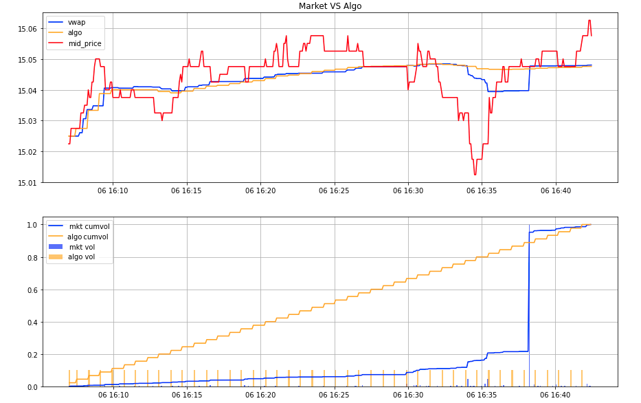

# Execution Algorithms Using Reinforcement Learning

- [Introduction](#introduction)
- [Motivation of the project](#motivation-of-the-project)

<!-- toc -->

## Introduction

In the financial industry, once an agent (natural person or financial institution) has made the decision to make or undo an investment in a particular asset, this decision is materialized by sending an instruction of purchase or sale to a broker.

Small amount orders are usually sent directly to the market through the broker, in which case it would be a DMA or direct market access order. These orders go through a series of controls established by the broker, but in general, they are not modify any of the order parameters (type, price, volume, shipping time, restrictions, etc).

Big enough orders are not sent directly to the market due to the impact that these can have when reaching the market due to their high volume. In these cases, CARE orders or orders to be cared for are sent. They reach the broker with the aim that the broker manages it throughout the time to avoid impacting the market.

The management of these orders has traditionally been carried out by traders or operators of market that manually chopped CARE orders into smaller orders (child orders), sent to the market and managed throughout the trading session. With the advance of the electronification of the markets, brokers began to develop execution algorithms that systematically carried out the work of hashing and management of CARE orders over time.

Execution algorithms are automated trading systems that receive an instruction complex by the client and transform it into a series of orders, modifications and cancellations. Those are sent over time to the different markets and brokers, with the objective of complying with the instruction given by the client, that is, maximizing the result obtained with respect to a specific benchmark.

The most used are the Slicing and Smart Order Routing algorithms. Slicing algorithms aim to distribute the volume of a large order over time. These algorithms confront what Robert Kissel and Morton Glantz (Optimal Trading Strategies: Quantitative Approaches for Managing Market Impact and Trading Risk - 2003) called the trader's dilemma: if the order is executed quickly, sending many orders in a short time to the market, there will be a great impact on the market that is translated to uncompetitive prices, while if the order takes a long time, the price it can evolve against us assuming a great market risk.

## Motivation of the project

This is the base of a 10 hours project designed to explain to my students the all process of a real reinforcement learning (RL) problem. Most of the problems they deal during the subject are, for simplicity, game simulators were the designed MDP is stationary and the focus is on the RL theory. Since the simulation part is a matter of programming and is usually *ad hoc* for the problem this is not a topic fully extended during the RL subjects.

Some students told me that they had skill enough to solve defined RL tasks but they had difficulties to desing and develop a complete project from the scratch. This repository is the result of that conversation, I prepared a project where the students could develop a naive order book simulator where they can place orders of a certain volume and execute them at a certain price. Using that order book simulator the main task is to develop the rewards and the RL models to obtain algorithms with a similar performance than the traditional algorithms currently used. The following image present an example of DQN following a TWAP policy.



``` Note: The simulator assumes multiple non realistic situations,for example the non market impact. ¡For a more realistic order book simulator to develop RL stay connected! ```
